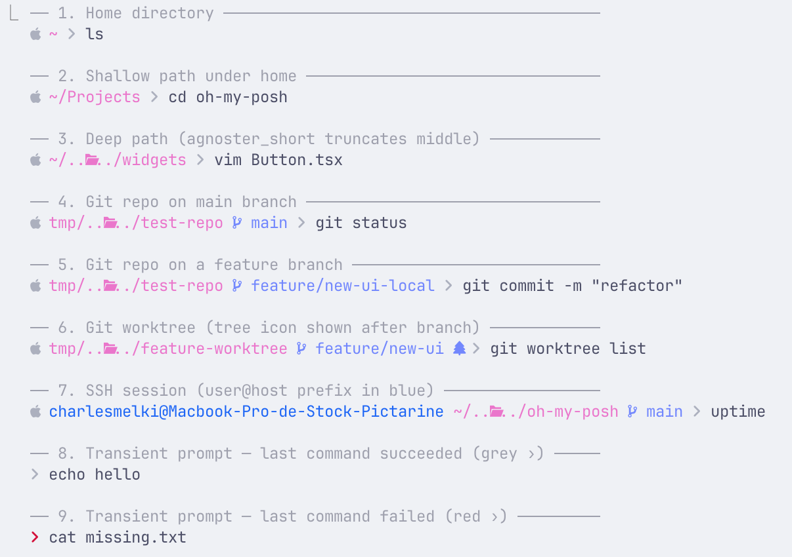
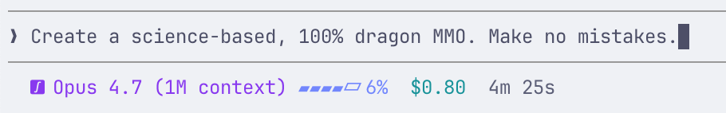

# Catppuccin Latte for Oh My Posh + Claude Code

Two [oh-my-posh](https://ohmyposh.dev/) themes in the [Catppuccin Latte](https://github.com/catppuccin/catppuccin) palette:

- **`catppuccin_latte.omp.json`** — shell prompt (zsh/bash/fish/...).
- **`catppuccin_latte_claude.omp.json`** — status line for [Claude Code](https://docs.claude.com/en/docs/claude-code), rendered via `oh-my-posh claude`.

Both files are standalone and can be used independently.

## Preview

Shell prompt across common situations:



Claude Code status line (colors shift as the context window fills):



```
󰿉 Opus 4.7   ▰▰▰▰▱ 9%    $0.42    2m 5s        (lavender  — normal)
󰿉 Opus 4.7   ▱▱▱▱▱ 85%   $8.50    15m 0s       (peach     — warning at >=80%)
󰿉 Opus 4.7   ▱▱▱▱▱ 97%   $14.20   30m 0s       (red       — critical at >=95%)
```

## Requirements

- **oh-my-posh** version `29.10+` (the `claude` subcommand was added in v29).
  ```sh
  brew install oh-my-posh
  # or: https://ohmyposh.dev/docs/installation
  ```
- **A Nerd Font** for the glyphs (OS icon, git branch, clock, dollar, Claude sparkle).
  Install any Nerd Font from <https://www.nerdfonts.com/> and set it as your terminal font. Recommended: `JetBrainsMono Nerd Font`, `FiraCode Nerd Font`, or `MesloLGS NF`.
- **Catppuccin terminal theme** (optional but recommended for matching ambient colors).
  - iTerm2: <https://github.com/catppuccin/iterm>
  - Other terminals: <https://github.com/catppuccin/catppuccin#-ports-and-more>

## Installation

### 1. Copy the theme files

Place both files wherever you like. The examples below assume your home directory:

```sh
cp catppuccin_latte.omp.json        ~/catppuccin_latte.omp.json
cp catppuccin_latte_claude.omp.json ~/catppuccin_latte_claude.omp.json
```

### 2. Enable the shell prompt

**zsh** — add to `~/.zshrc`:

```sh
eval "$(oh-my-posh init zsh --config ~/catppuccin_latte.omp.json)"
```

**bash** — add to `~/.bashrc`:

```sh
eval "$(oh-my-posh init bash --config ~/catppuccin_latte.omp.json)"
```

**fish** — add to `~/.config/fish/config.fish`:

```fish
oh-my-posh init fish --config ~/catppuccin_latte.omp.json | source
```

Reload your shell (`exec zsh` or open a new terminal).

### 3. Enable the Claude Code status line

Edit `~/.claude/settings.json` and add a `statusLine` block:

```json
{
  "statusLine": {
    "type": "command",
    "command": "oh-my-posh claude --config ~/catppuccin_latte_claude.omp.json",
    "padding": 0
  }
}
```

If `settings.json` already has other keys, merge the `statusLine` key alongside them — do not replace the whole file.

Restart Claude Code. The status line should now render in the Catppuccin Latte palette.

> **Why a separate config file?** `oh-my-posh claude --config <file>` renders every block in that file. Keeping the Claude segments in their own file prevents your shell prompt (`user@host path git`) from leaking into the Claude Code status line.

## What's in each file

### `catppuccin_latte.omp.json`

A single prompt block with these segments:

| Segment   | Color    | Hex         | Notes                                         |
| --------- | -------- | ----------- | --------------------------------------------- |
| OS icon   | OS grey  | `#ACB0BE`   | Rendered via `{{.Icon}}`                      |
| Session   | Blue     | `#1e66f5`   | `user@host`                                   |
| Path      | Pink     | `#ea76cb`   | `agnoster_short` style, `~` for home           |
| Git       | Lavender | `#7287FD`   | Branch / tag / commit icons                   |
| Closer    | OS grey  | `#ACB0BE`   | `` arrow                                     |

### `catppuccin_latte_claude.omp.json`

A single prompt block with four `claude`-type segments:

| Segment          | Default  | Hex         | Notes                                               |
| ---------------- | -------- | ----------- | --------------------------------------------------- |
| Model name       | Mauve    | `#8839ef`   | `󰿉 {{ .Model.DisplayName }}`                        |
| Token gauge      | Lavender | `#7287fd`   | Switches to Peach `#fe640b` at >=80%, Red `#d20f39` at >=95% |
| Cost             | Teal     | `#179299`   | ` {{ .FormattedCost }}`                            |
| Duration         | Subtext1 | `#5c5f77`   | ` {{ .FormattedDuration }}`                        |

The threshold switch uses `foreground_templates` with `atoi`:

```json
"foreground_templates": [
  "{{ if ge (atoi .TokenUsagePercent.String) 95 }}p:red{{ end }}",
  "{{ if ge (atoi .TokenUsagePercent.String) 80 }}p:peach{{ end }}"
]
```

Order matters — oh-my-posh applies the first template that returns a non-empty value, so list the stricter threshold first.

## Customization

### Swap the accent

The Catppuccin Latte palette (from the [style guide](https://github.com/catppuccin/catppuccin/blob/main/docs/style-guide.md)) gives you plenty of accent colors. To change the model-name color from Mauve to, say, Sapphire, edit the palette:

```json
"palette": {
  "mauve":    "#209fb5",   // was #8839ef — now Sapphire
  ...
}
```

Full Latte accent hex codes:

| Name       | Hex       |
| ---------- | --------- |
| Rosewater  | `#dc8a78` |
| Flamingo   | `#dd7878` |
| Pink       | `#ea76cb` |
| Mauve      | `#8839ef` |
| Red        | `#d20f39` |
| Maroon     | `#e64553` |
| Peach      | `#fe640b` |
| Yellow     | `#df8e1d` |
| Green      | `#40a02b` |
| Teal       | `#179299` |
| Sky        | `#04a5e5` |
| Sapphire   | `#209fb5` |
| Blue       | `#1e66f5` |
| Lavender   | `#7287fd` |

### Show different Claude data

Available template properties on the `claude` segment (see [docs](https://ohmyposh.dev/docs/segments/cli/claude)):

- `.Model.DisplayName`, `.Model.ID`
- `.TokenUsagePercent.Gauge`, `.TokenUsagePercent.GaugeUsed`, `.TokenUsagePercent.String`
- `.FormattedCost`, `.FormattedTokens`, `.FormattedDuration`, `.FormattedAPIDuration`
- `.Cost.TotalCostUSD`, `.Cost.TotalLinesAdded`, `.Cost.TotalLinesRemoved`
- `.ContextWindow.TotalInputTokens`, `.ContextWindow.TotalOutputTokens`
- `.Workspace.CurrentDir`, `.Workspace.ProjectDir`, `.Workspace.GitWorktree`
- `.RateLimits.FiveHourRateLimit.UsedPercentage`, `.RateLimits.SevenDayRateLimit.UsedPercentage`

Example — add lines changed:

```json
{
  "foreground": "p:green",
  "style": "plain",
  "template": " +{{ .Cost.TotalLinesAdded }} -{{ .Cost.TotalLinesRemoved }}",
  "type": "claude"
}
```

### Dark mode (Mocha / Macchiato / Frappe)

This repo ships Latte only. To adapt to a dark variant, replace every hex in both files' `palette` blocks with the equivalent from the target flavor. Hex values for all flavors: <https://github.com/catppuccin/catppuccin/blob/main/docs/style-guide.md#colors>.

## Testing locally without launching Claude Code

You can pipe a fake Claude Code payload into `oh-my-posh claude` to preview changes:

```sh
echo '{
  "session_id":"abc",
  "model":{"id":"claude-opus-4-7","display_name":"Opus 4.7"},
  "workspace":{"current_dir":"/","project_dir":"/"},
  "cost":{"total_cost_usd":0.42,"total_duration_ms":125000,"total_api_duration_ms":48000,"total_lines_added":120,"total_lines_removed":30},
  "exceeds_200k_tokens":false,
  "context_window":{
    "total_input_tokens":18400,"total_output_tokens":2100,"context_window_size":200000,
    "current_usage":{"input_tokens":18400,"output_tokens":2100,"cache_creation_input_tokens":0,"cache_read_input_tokens":0}
  }
}' | oh-my-posh claude --config ~/catppuccin_latte_claude.omp.json
```

Bump `total_input_tokens` to `170000` (85%) or `194000` (97%) to preview the threshold colors.

## Terminal setup (iTerm2)

Not required — oh-my-posh paints the prompt regardless — but these three things make the whole terminal match the Latte aesthetic:

1. **Nerd Font** (required for glyphs):
   ```sh
   brew install --cask font-jetbrains-mono-nerd-font
   ```
   Preferences → Profiles → Text → Font → `JetBrainsMono Nerd Font`.

2. **Catppuccin Latte color preset** (for background + ANSI palette):
   Grab `catppuccin-latte.itermcolors` from <https://github.com/catppuccin/iterm>, then Preferences → Profiles → Colors → **Color Presets…** → Import → select it.

3. **Latte-specific toggles** (Profiles → Colors):
   - Minimum contrast → `0` (slider left).
   - "Draw bold text in bright colors" → off.
   - "Use built-in Powerline glyphs" (Text tab) → off.

Other terminals: install any Nerd Font and apply the matching Catppuccin Latte preset from <https://github.com/catppuccin/catppuccin#-ports-and-more>.

## Credits

- [oh-my-posh](https://github.com/JanDeDobbeleer/oh-my-posh) by Jan De Dobbeleer.
- [Catppuccin](https://github.com/catppuccin/catppuccin) color palette.
- Base layout derived from the upstream [`catppuccin_latte.omp.json`](https://github.com/JanDeDobbeleer/oh-my-posh/blob/main/themes/catppuccin_latte.omp.json) theme.

## License

MIT — do whatever you want, attribution appreciated.
